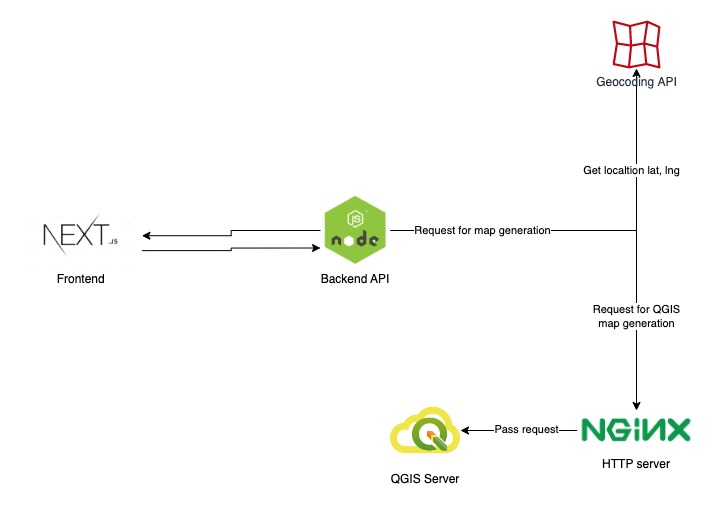

# Mapogram

[](https://bitbucket.org/slashdigital/mapogram-web-app/branches/?search=master)

**Mapogram** is a platform powered by containerized QGIS server, which supported by any container infrastructure, to provide map generation service for the map they needed to deal with natural disaster like Forest fire, Flood event etc...


This project adheres to the Contributor Covenant [code of conduct](CODE_OF_CONDUCT.md).
By participating, you are expected to uphold this code. Please report unacceptable behavior to sean@slash.co.

## Documentation

If you want to read about using Mapogram or developing packages in Mapogram, the [Mapogram Manual](https://bitbucket.org/slashdigital/mapogram-web-app/src/master/doc) is free and available online.

The [API reference](https://atom.io/docs/api) for developing packages is also documented.

## Installing

### Prerequisites
- [Node.JS](https://nodejs.org)
- [Docker](https://www.docker.com)
- [QGIS](https://www.qgis.org)

## Building

* [Mapogram Installation Manual](INSTALL.md)

## Contributing

* [Contributing to Mapogram](CONTRIBUTING.md)
* [Mapogram Pull Request Templates](PULL_REQUEST_TEMPLATE.md)

## Change Log

* [Mapogram Change Log](CHANGELOG.md)

## License

* [GNU GPL v3.0](COPYING)

## Architecture Diagram



In this project, we use:
- `frontend` and `backend api` for serving web application
- `QGIS server` is used to open GGIS project and generate flood information on specify area
- `nginx`: to serve http request which required for QGIS Server
- `Geocoding`: to get latitude and longitude from google api

## Setup local development

### 0. Install dependencies

- Make sure you have `docker`
- Install the dep: `yarn install`

### 1. Setup ENV

After pull the project, find out the .env.example file in the `root directory`.

If you found the file, do this command:

```bash
cp .env.example .env
```

After copy the file, there are some configuration that you need to concern, but it's up to you, I mean the `.env` file has default value for configuration. 

Example

```bash

# Docker Settings
PROJECT_DIRECTORY=./
PORT=3000
POSTGRES_PORT=5432
POSTGRES_PASSWORD=mapogram123
POSTGRES_USER=postgres
POSTGRES_DB=mapogram
NODE_ENV=development
POSTGRES_SCHEMA=public
POSTGRES_HOST=localhost
DATABASE_URL="postgresql://postgres:mapogram123@${POSTGRES_HOST}:5432/mapogram?schema=public"

API_URL=http://localhost:3000/

```

### 2. Run DB locally
### 2.1. If you run in your local machine directly

Run command: `docker-compose up db` to run the database at localhost and port 5432
### 2.2. If you're using Docker
please change POSTGRES_HOST from `localhost` to `db` 
```
POSTGRES_HOST=db
```

If the `.env` file seems right to you, do this command:

```bash
yarn localstack 
```

Let's waiting for the process, and voila! Everything was created for you (web-app, nginx, gis-server and db)


### 3. For new DB or first time, run the DB migration
- **If you are using docker, please enter container: `docker exec -it [mapogram-web-container-id] sh #replace [mapogram-web-container-id] by the actual id of the container`
- Generate the prisma client: `yarn prisma:generate`
- Run Migration: `yarn migrate`
- Run Migration deploy (to make sure): `yarn migrate:deploy`
- Seed some data: `yarn seed`

Then you are ready to have the DB running, please also check if the DB is actually running with docker as well.

### 4. Run the project ( skip this if you're using docker)

Run `yarn dev` to start the application.

### 5. Rebuild the docker image ( skip this if you run directly on local machine)

*If container does not reflect your change, you can rebuild image to reflect latest changes*
Run following command
```bash
yarn localstack:build
```
## Database Migration

### How to Create Migration


Command for prisma

 ./node_modules/.bin/prisma init  

 ./node_modules/.bin/prisma format   

./node_modules/.bin/prisma generate   

./node_modules/.bin/prisma migrate dev  


# Deploy to VPS

## 1. Docker installation
Please refer to this [Official Link](https://docs.docker.com/engine/install/ubuntu/)

To run docker command without sudo:
```bash
sudo usermod -a -G docker [user] #Where [user] is your login user
newgrp docker
```

## 2. Create folder to store nginx config, gis data and generated image
```bash
mkdir -p /home/ubuntu/project-data/gis-data
mkdir -p /home/ubuntu/project-data/nginx
mkdir -p /home/ubuntu/project-data/public
```

## 3. Copy mapogram data to created folder
```bash
scp -i ~/mapogram-key.pem data ubuntu@@13.250.17.55:home/ubuntu/project-data/gis-data
```

## 4. Add/Update VPS IP in deployment variable
Go to deployment variable and update 2 variables below
```bash
HOST_IP=[VPS ip]
DOCKER_HOST=[username]@[VPS ip]
```

## 5. Allow pipeline to access VPS
1. Go to `SSH key` tab in repository setting
1. Add private key from mapogram-key.pem
1. Add public key from generate from: `ssh-keygen -f ~/mapogram-key.pem -y`
1. Below the SSH key, fetch fingerprint by input VPS IP, and add to Known Hosts

## 6. For new DB
1. ssh to VPS
1. Run database migration inside web-app container
```bash
docker exec -it [mapogram-web-container-id] sh
npm run migrate:deploy
npm run seed
exit
```

## 7. For updating migration
1. ssh to VPS
1. Run database migration inside web-app container
```bash
docker exec -it [mapogram-web-container-id] sh
npm run migrate:deploy
exit
```
